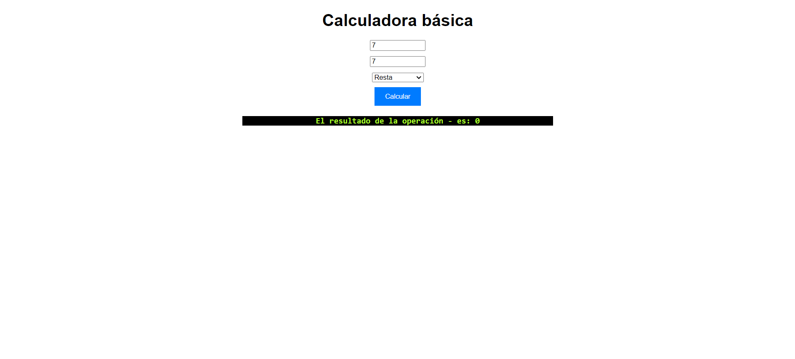

# Calculadora-examen
- Versión: 0.1
- Autor: **Ruth Rama Villanueva**
- Licencia: MIT

## Descripción general:
Esta aplicación tiene como intención de simular una calculadora real dando el resultado clicando un boton.
## Instalación
Descarga el zip de la siguiente url:
[https://github.com/Rram1313/calculadora-examen.git](https://github.com/Rram1313/calculadora-examen.git)
o en el shell haz un git clone.
```shell
git clone https://github.com/Rram1313/calculadora-examen.git
```
una vez descargado incluyalo en un repositorio y ejecutalo a través de un navegador.
```
http://localhost:3000/calculadora-examen
```
## Tecnologías utilizadas.
**html, css y js**


## Instrucciones de uso
1. Introducir el primer numero en la primera casilla.
2. Introducir el segundo numero en la psegundo casilla.
3. Elegir en el desplegable que operación se quiere hacer.
4. Pulsar el botón para visualizar el resultado dde la operación.
## Solución de problemas:
- Si no hay un numero disponible aparecerá un mensaje "En ambos campos se deben introducir números" gracias al codigo:
  ```js
  divResultado.textContent = `
    El resultado de la operación ${operacion} es: ${resultado}
    `;
  ```
- Si la operación no es valida aparecera "Operación no válida" gracias al codigo:
  ```js
  default:
            divResultado.textContent= 'Operación no válida';
            return;
  ```
- No se puede dividir entre cero por lo que si se intenta saldra el mensaje de "No se puede dividir por cero" gracias al codigo:
  ```js
  case '/':
            if (num2 === 0) {
                divResultado.textContent= 'No se puede dividir por cero';
                return;
            }
  ```
- Actualmente se pueden operar tambien numeros negativos.
- Se cambiara el estilo opara asemejarse más a una calculadora real.
## Información de contacto:
Puedes contactar con nostros, o proponer tu contribución a través de nuestro correo:
[ruthrama.tandem@gmail.com](mailto:ruthrama.tandem@gmail.com)
[Teléfono: 666131751](tel:+34666131751)
### Reconocimientos:
>Agradecimientos a MDN por sus tutoriales.
### Apéndices:
Más información en nuestro github:
[Rram1313](https://Rram131.github.io)
## Versiones
|Versión|Fecha|Cambios|
|--|--|--|
|0.1|19/04/24|Funcionalidad básica|